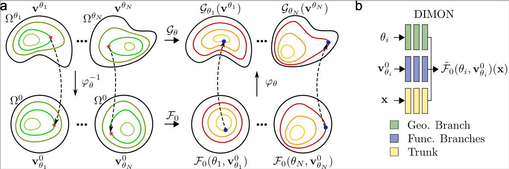

# DIffeomorphic-Mapping Operator learNing (DIMON)
We introduce a neural operator framework, named **DIffeomorphic Mapping Operator learNing (DIMON)**, which allows AI to learn geometry-dependent solution operators of different types of PDEs on a wide variety of geometries. Nature Computational Science: https://www.nature.com/articles/s43588-024-00732-2

**Data**: https://doi.org/10.5281/zenodo.13958884

**Note**: Data in example 3 is not included in this link as the heart geometries are patient-specific clinical data. Data in Example 3 can be provided by request to the corresponding authors and potentially after an IRB for sharing data is approved.

## Environments
>python >= 3.7.4

>torch >= 1.2.0 (this legacy version is compatible with CUDA==10.2, the new versiosn can be used if CUDA driver is compatible.)

>pip >= 24.0

Installation requires about 1 min on a personal laptop. torch version has to be compatible with the CUDA driver. https://pytorch.org/get-started/previous-versions/

## Examples
This repository contains three examples: solving the Laplace equation on 2D domains, solving reaction-diffusion equations on 2D annulus, and predicting electrical wave propagation on patient-specific left ventricles.

0. download data to the main folder

1. create a virtual environment and install packages

>`python -m venv dimon`

>`source YOUR_PATH/dimon/bin/activate`

>`pip install torch matplotlib scipy scikit-learn`

2. network training
   
>`cd EXAMPLE_FOLDER`

>`python main.py --epoch 10000`

**Note**: please train with the same number of epochs to reproduce the results in the paper.

**Note**: the ten Tusscher model is adopted from the cellular model in CellML repository. 

